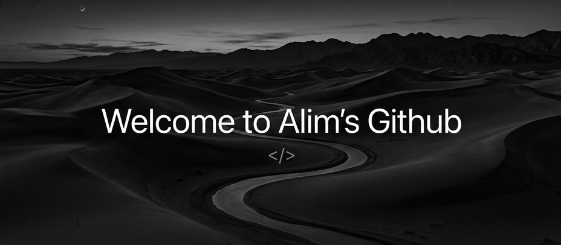

  

  
  
  

---

###  About me

<table border="0">
  <tr>
    <td width="60%" valign="top">
      
Hello There! I'm <b>Alim</b>, a Fullstack Developer and AI Enthusiast. I enjoy building innovative technologies and solving complex problems with AI. Currently, I'm working on high-performance mobile apps and autonomous agent workflows.

      <ul>
        <li>🎓 <b>Focused on</b>: Advanced AI Integration & Cloud Architecture</li>
        <li>💻 <b>Specializing in</b>: Flutter, Node.js, and LLM Engineering</li>
        <li>🧠 <b>Passionate about</b>: Autonomous Agent Development</li>
      </ul>
    </td>
    <td width="40%" align="center">
      
    </td>
  </tr>
</table>

---

### ⚙️ Technologies

  

---

### 📊 Statistics

  
  

---

### 📈 Activity Graph

  

  

  

