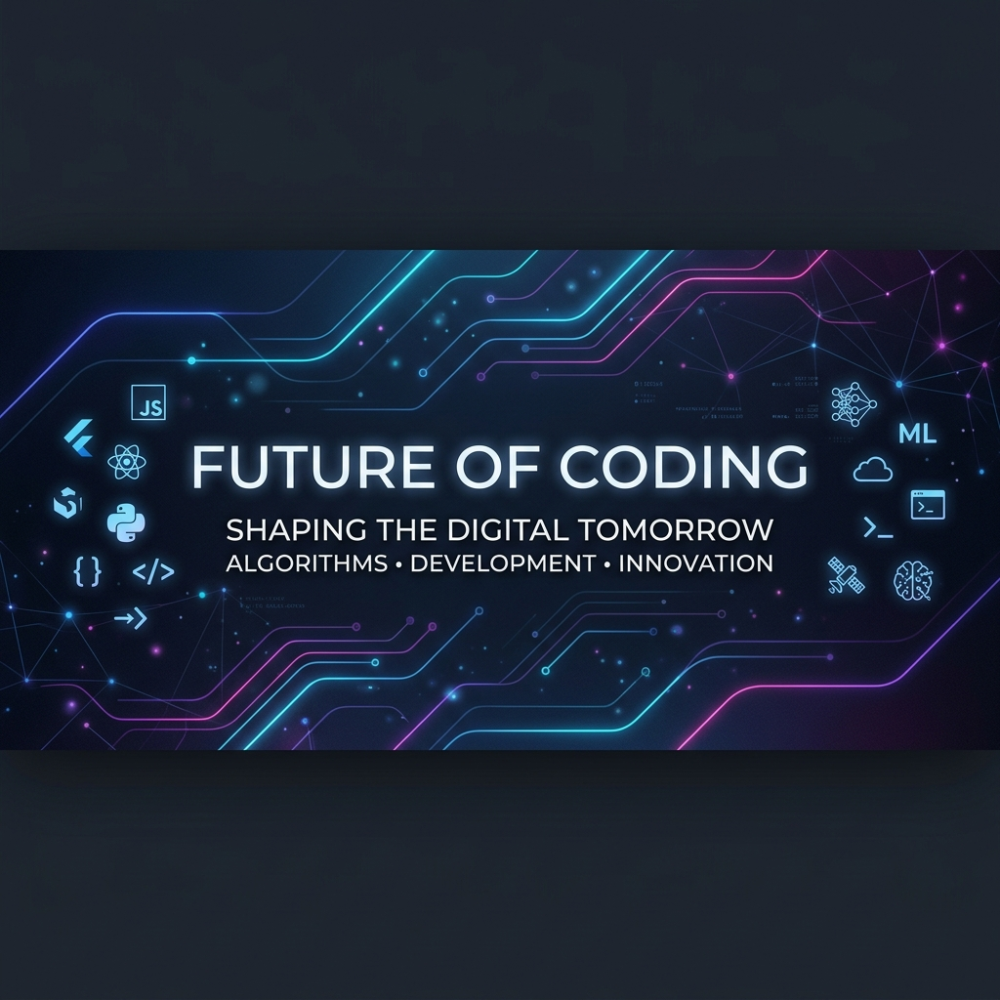

# 🚀 Alim's Portfolio | Fullstack & AI Developer

  

---

### 👨‍💻 About Me
I am a passionate **Fullstack Developer** and **AI Enthusiast** dedicated to building tools that bridge the gap between human needs and machine intelligence. My work ranges from healthcare applications to autonomous agent frameworks.

- 🔭 **Current Focus**: Advanced AI integration and cross-platform architecture.
- 🧠 **AI Research**: Integrating Gemini, Ollama, and custom LLM workflows into mobile and desktop apps.
- ⚡ **Philosophy**: "Simplicity is the ultimate sophistication."

---

### 🏆 Featured Projects

<table width="100%">
  <tr>
    <td width="100%" valign="top">
      <h4>🧠 Obsidian Agent</h4>
      
An autonomous development environment integrated into Obsidian, enabling real-time code analysis and AI-driven edits.

      

        
        
        
      

    </td>
  </tr>
</table>

---

### 🚀 Project Ecosystem

| Project | Description | Tech Stack | Status |
| :--- | :--- | :--- | :--- |
| **EduClass** | Role-based educational portal for teachers & students. | Flutter, Firestore | 🟢 Stable |
| **Bilim** | Knowledge management & educational platform. | React, Node.js | 🟡 Dev |
| **History Parser** | High-performance tool for exam data extraction. | Python, JS | ✅ Complete |
| **Alfa** | Fullstack startup prototype for market analysis. | MERN Stack | 🧪 Research |
| **AI Assistant** | Personal productivity suite with LLM integration. | Flutter, Dart | 🟡 Beta |

---

### 🛠 Tech Arsenal

  

---

### 📊 GitHub Activity

  

  

---

### 📬 Let's Connect

  
  
  

  

